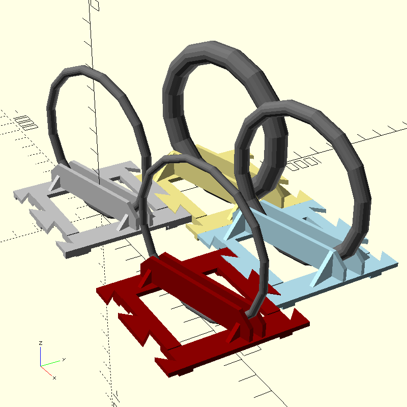

# Bike Rack

In this project,
we designed a parametric model of a wooden bike rack and
built it out of excess pine board.
This was necessary since no bike rack
on the market could simultaneously support
the narrow tires of a road bike and
the wide tires of a fatbike.
We should also note that "we" refers to Sampsa Kiiskinen,
the sole author of this project.

## Options

There are two options that produce a total
of four variations of the model.
In economy mode, the rack uses less wood, and
without reinforcements, the rack uses less screws.
